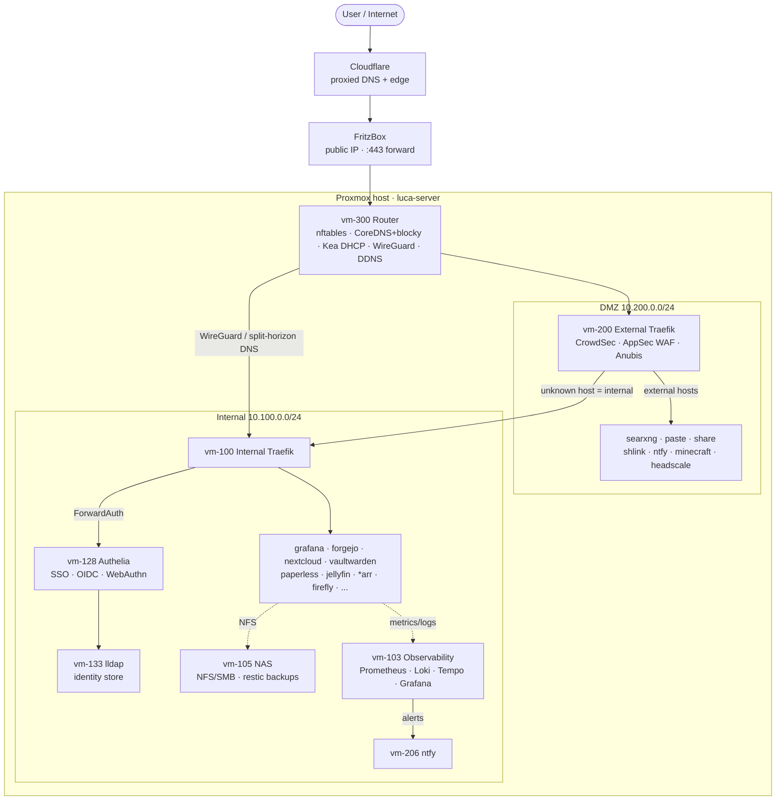

# Homelab

Declarative Proxmox + NixOS homelab. Every VM is a NixOS flake config; every VM
is provisioned by Terraform. One command deploys the whole fleet:

```sh
./sync.sh
```

- **Networks:** `10.100.0.0/24` internal (Authelia-gated) · `10.200.0.0/24` DMZ (public) · `10.0.0.0/24` WireGuard
- **Ingress:** Cloudflare (proxied) → FritzBox `:443` → router `192.168.178.29` → external Traefik → service, or relayed to internal Traefik
- **Identity:** lldap (store + admin UI) · Authelia (SSO/OIDC + ForwardAuth, WebAuthn/FIDO2)
- **Edge security:** CrowdSec bouncer + AppSec WAF + Anubis bot filter (external); Authelia two-factor (internal)
- **Observability:** Prometheus + Loki + Tempo + Grafana + Alertmanager → ntfy
- **Storage & backup:** NAS (NFS/SMB/Syncthing) + encrypted, verified restic backups (`nas-restore`)

## Services

### Internal — `10.100.0.0/24` (behind Authelia)

| VM | Host | Service |
|----|------|---------|
| 100 | `traefik.lsck0.dev` | Internal reverse proxy (TLS/ACME, Authelia ForwardAuth, on-demand proxy) |
| 102 | `homepage.lsck0.dev` | Dashboard / service landing page |
| 103 | `grafana.lsck0.dev` | Metrics, logs, traces, alerting |
| 104 | `status.lsck0.dev` | Uptime Kuma |
| 105 | `nas.lsck0.dev` | NAS — NFS + SMB + Syncthing + FileBrowser + backups |
| 106 | `sccache.lsck0.dev` | Shared compile cache |
| 107 | `git.lsck0.dev` | Forgejo git forge (SSO-only) |
| 108 | — | Forgejo CI runner |
| 109 | `registry.lsck0.dev` | Docker registry (LAN/VPN only) |
| 110 | `tasks.lsck0.dev` | Taskwarrior sync (TaskChampion) |
| 111 | `vault.lsck0.dev` | Vaultwarden password manager |
| 112 | `cloud.lsck0.dev` | Nextcloud |
| 113 | `paperless.lsck0.dev` | Paperless-ngx documents |
| 114 | `huginn.lsck0.dev` | Automation agents |
| 115 | `hass.lsck0.dev` | Home Assistant |
| 116 | `wiki.lsck0.dev` | Wiki.js |
| 117 | `torrent.lsck0.dev` | qBittorrent (via Tor) |
| 118–120 | `prowlarr/radarr/sonarr.lsck0.dev` | *arr media automation |
| 121 | `jellyfin.lsck0.dev` | Jellyfin media server |
| 122 | `abs.lsck0.dev` | Audiobookshelf |
| 123 | `music.lsck0.dev` | Navidrome |
| 124 | `read.lsck0.dev` | Kavita |
| 125 | `paperless-ai.lsck0.dev` | AI document tagging |
| 126 | `hermes.lsck0.dev` | GPU LLM agent (Ollama, RTX 2060) |
| 127 | — | Tor SOCKS router |
| 128 | `auth.lsck0.dev` | Authelia SSO / OIDC |
| 129 | `cal.lsck0.dev` | Synced calendar feeds |
| 131 | `attic.lsck0.dev` | Nix binary cache |
| 132 | — | SMTP relay |
| 133 | `lldap.lsck0.dev` | LDAP identity store + admin |
| 135 | `budget.lsck0.dev` | Actual Budget · on-demand |
| 136 | `requests.lsck0.dev` | Jellyseerr |
| 137 | `subs.lsck0.dev` | Bazarr subtitles |
| 138 | — | Recyclarr |
| 139 | — | Mosquitto MQTT |
| 140 | `firefly.lsck0.dev` | Firefly III finance · on-demand |

### External — `10.200.0.0/24` (public, DMZ)

| VM | Host | Service |
|----|------|---------|
| 200 | — | External reverse proxy (CrowdSec + WAF + Anubis + relay) |
| 201 | `hs.lsck0.dev` | Headscale (Tailscale control) |
| 202 | `search.lsck0.dev` | SearXNG metasearch · on-demand |
| 203 | `shlink.lsck0.dev` | URL shortener |
| 204 | `paste.lsck0.dev` | PrivateBin · on-demand |
| 205 | `share.lsck0.dev` | File sharing · on-demand |
| 206 | `ntfy.lsck0.dev` | Push notifications |
| 207 | `mc.lsck0.dev` | Minecraft · on-demand |
| 208 | `hello.lsck0.dev` | Demo / swarm test |
| 209 | — | Tor relay (non-exit) |
| 300 | — | Router — NAT, firewall, DHCP, DNS/blocky, WireGuard, DDNS |

## Architecture



## Layout

- `src/instances/*.nix` — one NixOS config per VM (`<id>-<zone>-<name>.nix`)
- `src/instances/main.tf` — the VM inventory (id → name, resources, flags)
- `src/modules/*.nix` — shared modules (`traefik`, `on-demand`, `nas-backup`, `base`)
- `sync.sh` — build every closure, copy to each VM, switch, commit `Generation: N`
